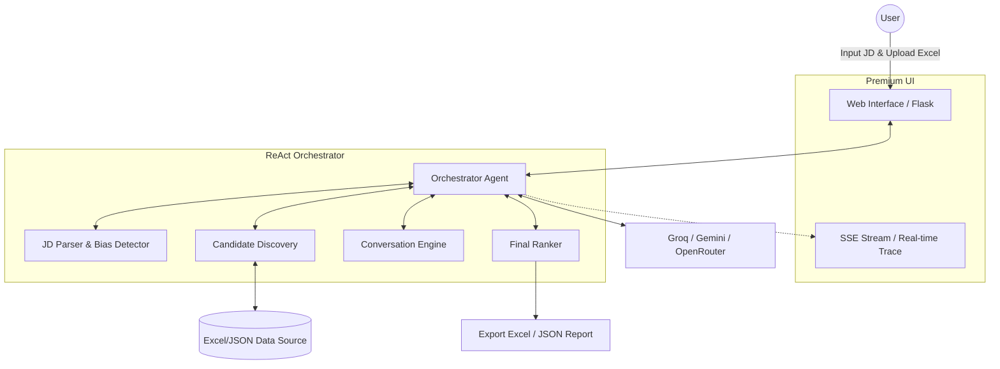
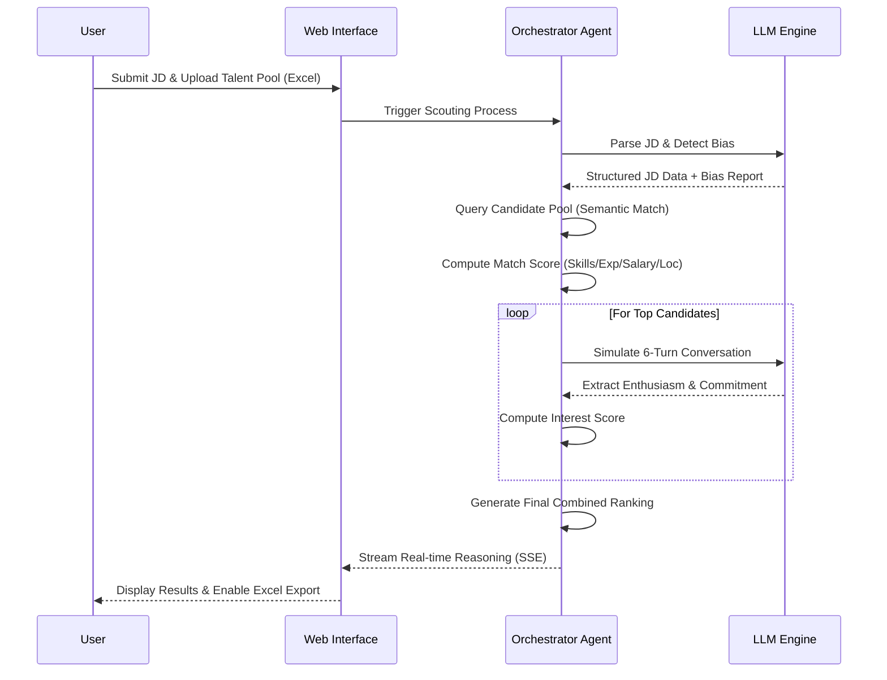

# 🎯 AI Talent Scout — Autonomous Recruitment Agent

<div align="center">
  <em>An autonomous ReAct-based AI agent that transforms recruitment from manual searching to intelligent, automated talent scouting.</em>
</div>
<br>

An **autonomous AI agent** that takes a Job Description as input, discovers matching candidates from a dynamic talent pool, engages them through simulated conversations, and outputs a ranked shortlist scored on **Match Score** and **Interest Score** — ready for recruiters to act on immediately.

> Built with a **ReAct (Reason-Act-Observe)** agentic architecture — the agent autonomously plans, makes decisions, adjusts thresholds, and produces a full reasoning trace.


---

## 🏆 Why This Project Stands Out (Hackathon Approach)

Our approach focuses on **autonomy, scalability, and fairness**, moving beyond simple keyword matching to create a truly intelligent recruitment assistant.

1. **True Agentic Autonomy (ReAct)**: Instead of linear prompt chains, the agent uses a Reason-Act-Observe loop. It dynamically adjusts search thresholds, handles edge cases, and provides a transparent "thought process" (reasoning trace) in real-time.
2. **Dual-Dimensional Scoring**: We evaluate not just *capability* (Match Score via semantic skill matching) but also *willingness* (Interest Score via persona-based simulated conversations), mirroring a real recruiter's evaluation.
3. **Enterprise-Ready Data Integration**: Seamlessly integrates with Excel (`.xlsx`) for dynamic candidate pool management. Users can upload custom datasets, view stats, and export AI-ranked results instantly.
4. **Ethical AI & Market Intelligence**: Built-in Bias Detection scans job descriptions for exclusionary language, while Market Intelligence provides salary benchmarks and hiring difficulty ratings.
5. **Premium Developer & User Experience**: A highly polished, Material Design-inspired UI with Dark/Light mode, glassmorphic elements, and real-time Server-Sent Events (SSE) streaming of the agent's thought process.

---

## 🏗️ System Architecture



## 🔄 Execution Flow



## ✨ Key Features

| Feature | Description |
|---------|-------------|
| **🤖 ReAct Agent Loop** | Autonomous decision-making, dynamic threshold adjustment, and transparent reasoning traces. |
| **📄 LLM-Powered Parser** | Extracts structured requirements from free-text JDs using Groq/Gemini/OpenRouter. |
| **📊 Dynamic Excel Data** | Upload custom `.xlsx` candidate pools, view dataset statistics, and export detailed shortlists. |
| **🧠 Semantic Matching** | Synonym resolution + fuzzy matching (e.g., React ≈ ReactJS) for precise skill evaluation. |
| **💬 Conversation Engine** | 6-turn persona-based simulated dialogues to gauge candidate enthusiasm and engagement. |
| **⚖️ Bias & Market Intel** | Scans JDs for gender/age bias and provides real-time salary benchmarks and hiring difficulty. |
| **🖥️ Premium UX/UI** | Material Design UI, Dark/Light mode toggle, glassmorphism, and SSE streaming. |
| **🔄 Multi-LLM Fallback** | Automatic failover between Groq → Gemini → OpenRouter for high reliability. |

---

## 🚀 Quick Start

### 1. Clone & Install

```bash
git clone https://github.com/YOUR_USERNAME/talent-scout-agent.git
cd talent-scout-agent
python -m venv venv
venv\Scripts\activate        # Windows
# source venv/bin/activate   # Mac/Linux
pip install -r requirements.txt
```

### 2. Configure API Keys

Copy `.env.example` to `.env` and add at least ONE API key:

```bash
cp .env.example .env
```

```env
# Get free keys from:
# Groq: https://console.groq.com/keys
# Google AI: https://aistudio.google.com/apikey  
# OpenRouter: https://openrouter.ai/keys

GROQ_API_KEY=your_key_here
GOOGLE_API_KEY=your_key_here
OPENROUTER_API_KEY=your_key_here
```

### 3. Run

**Web UI (recommended):**
```bash
python app.py
# Open http://localhost:5000
```

**CLI:**
```bash
python main.py --jd demo/sample_jd.txt
```

### 4. Deploy (Render or Docker)

[](https://render.com/deploy)

Or use Docker:
```bash
docker build -t talent-scout .
docker run -p 5000:5000 --env-file .env talent-scout
```

---

## 📊 Scoring Methodology

### Match Score (0-100) — 60% Weight
| Factor | Weight | Calculation Logic |
|--------|--------|-------------------|
| Skills | 40 pts | Semantic overlap, synonym resolution, and fuzzy matching. |
| Experience | 25 pts | Range fit with a penalty for under/over qualification. |
| Salary | 20 pts | Budget alignment with an over-budget penalty curve. |
| Location | 15 pts | Exact match, remote bonus, relocation feasibility. |

### Interest Score (0-100) — 40% Weight
| Factor | Weight | Calculation Logic |
|--------|--------|-------------------|
| Enthusiasm | 40 pts | Positive/negative signal detection in conversation text. |
| Engagement | 30 pts | Questions asked, response length, engagement markers. |
| Commitment | 30 pts | Availability signals, notice period, commitment language. |

### Final Combined Score
```text
Combined = (Match × 0.6) + (Interest × 0.4)
```

| Tier | Score | Recommended Recruiter Action |
|------|-------|-----------------------------|
| 🔥 Priority Hire | ≥ 85 | Contact within 24 hours |
| ⚡ Fast-Track | ≥ 75 | Schedule interview this week |
| ✅ Recommended | ≥ 65 | Standard interview pipeline |
| 📝 Backup | < 65 | Keep warm for future roles |

---

## 📁 Project Structure

```text
talent-scout-agent/
├── app.py                    # Flask web app with SSE streaming & Excel handling
├── main.py                   # CLI interface
├── agent/
│   ├── orchestrator.py       # 🤖 ReAct agent loop (core)
│   ├── jd_parser.py          # LLM-powered JD parsing
│   ├── discovery.py          # Excel/JSON Candidate pool search
│   ├── matcher.py            # Multi-factor match scoring
│   ├── semantic_matcher.py   # Synonym + fuzzy skill matching
│   ├── conversation_engine.py# 6-turn persona-based dialogues
│   ├── interest_analyzer.py  # Interest signal extraction
│   ├── ranker.py             # Combined score ranking
│   ├── bias_detector.py      # ⚖️ JD bias analysis
│   ├── market_intel.py       # 📈 Market intelligence
│   ├── llm_engine.py         # Multi-provider LLM fallback
│   └── output.py             # Report generation (Excel/JSON/MD)
├── data/
│   ├── candidates.xlsx       # Dynamic Excel candidate pool
│   └── candidates.json       # Fallback candidate talent pool
├── templates/
│   └── index.html            # Premium web UI (Dark/Light mode)
├── static/
│   └── style.css             # Glassmorphic Material Design system
├── demo/                     # Sample JD files
├── Dockerfile                # Container deployment
└── render.yaml               # Render.com config
```

## 🛠️ Tech Stack

- **Agent Framework:** Custom ReAct orchestrator with tool-calling architecture
- **LLMs:** Groq (Llama 3.3 70B), Google Gemini 1.5 Pro/Flash, OpenRouter
- **Backend:** Python 3.11, Flask
- **Frontend:** HTML/CSS/JS (Material UI, SSE streaming, Dark Mode)
- **Data Handling:** OpenPyXL (Excel), Pandas
- **Deployment:** Docker, Gunicorn, Render

## 📝 License

MIT License.
