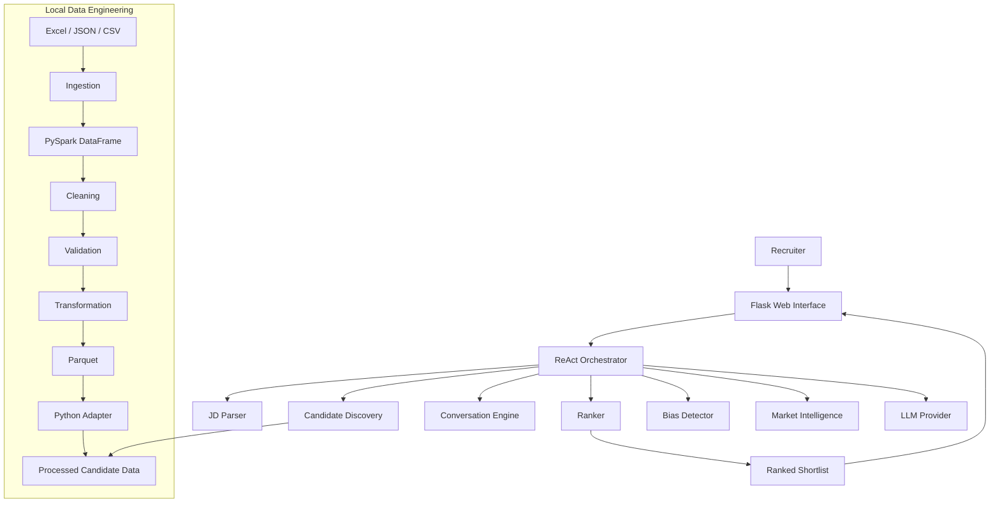
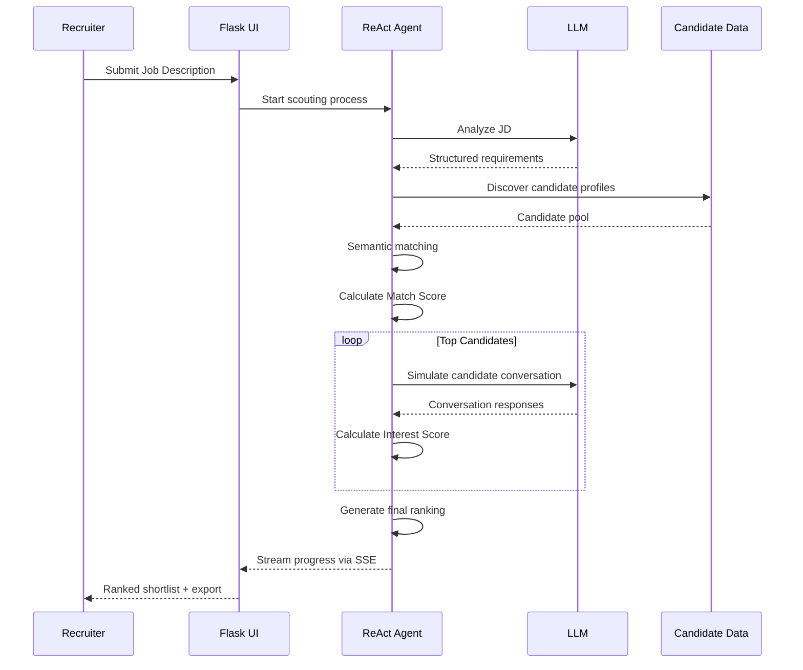

[AI_Talent_Scout_README_Professional.md](https://github.com/user-attachments/files/31552490/AI_Talent_Scout_README_Professional.md)
# AI Talent Scout — Autonomous Recruitment Agent

> An autonomous AI-powered recruitment assistant that transforms a Job Description into a ranked, recruiter-ready candidate shortlist using agentic reasoning, semantic matching, simulated candidate conversations, and a local PySpark data pipeline.

[](https://www.python.org/)
[](https://flask.palletsprojects.com/)
[](https://spark.apache.org/)
[](https://www.docker.com/)

**Live Demo:** https://prosphire-talent-scout.onrender.com/  
**Repository:** https://github.com/rainyyyyshrrr12/Prosphire-Talent-Scout

---

## Overview

AI Talent Scout is an autonomous recruitment system designed to reduce the manual effort involved in screening and evaluating candidates.

The system accepts a Job Description and a candidate pool, analyzes the hiring requirements, discovers relevant candidates, evaluates their technical and contextual fit, simulates candidate interactions, and produces a final ranked shortlist.

Unlike a simple keyword-matching system, the project uses a **ReAct (Reason–Act–Observe) architecture** to coordinate multiple recruitment tasks and dynamically make decisions during the scouting process.

The project also includes a **local PySpark ETL pipeline** that cleans, validates, transforms, and stores candidate data in Parquet before it reaches the AI layer.

---

## Key Capabilities

| Capability | Description |
|---|---|
| **Autonomous ReAct Agent** | Coordinates recruitment tasks through a Reason–Act–Observe workflow. |
| **JD Analysis** | Extracts structured requirements from natural-language job descriptions. |
| **Candidate Discovery** | Searches the available candidate pool for relevant profiles. |
| **Semantic Matching** | Goes beyond exact keywords using synonym and fuzzy matching. |
| **Multi-Factor Scoring** | Evaluates skills, experience, salary, and location compatibility. |
| **Candidate Conversation** | Simulates multi-turn conversations to estimate candidate interest. |
| **Interest Scoring** | Evaluates enthusiasm, engagement, and commitment signals. |
| **Bias Detection** | Identifies potentially exclusionary language in job descriptions. |
| **Market Intelligence** | Provides salary and hiring-difficulty insights. |
| **Data Engineering Pipeline** | Uses PySpark for local candidate-data ingestion, cleaning, validation, and transformation. |
| **Parquet Storage** | Stores normalized candidate data in an analytics-friendly columnar format. |
| **Excel Integration** | Supports `.xlsx` candidate pools and custom uploads. |
| **Real-Time UI** | Streams agent execution updates through Server-Sent Events (SSE). |
| **Exportable Results** | Produces recruiter-ready ranked outputs. |

---

## System Architecture


```mermaid
flowchart TD
    U[Recruiter] --> UI[Flask Web Interface]

    UI --> A[ReAct Orchestrator]

    A --> JD[JD Parser]
    A --> D[Candidate Discovery]
    A --> C[Conversation Engine]
    A --> R[Ranker]
    A --> B[Bias Detector]
    A --> M[Market Intelligence]

    D --> P[Processed Candidate Data]

    subgraph DataEngineering[Local Data Engineering]
        RAW[Excel / JSON / CSV]
        RAW --> ING[Ingestion]
        ING --> SP[PySpark DataFrame]
        SP --> CL[Cleaning]
        CL --> V[Validation]
        V --> T[Transformation]
        T --> PQ[Parquet]
        PQ --> AD[Python Adapter]
        AD --> P
    end

    A --> L[LLM Provider]
    R --> O[Ranked Shortlist]
    O --> UI
```

---

## Recruitment Workflow


```mermaid
sequenceDiagram
    participant Recruiter
    participant UI as Flask UI
    participant Agent as ReAct Agent
    participant LLM as LLM
    participant Data as Candidate Data

    Recruiter->>UI: Submit Job Description
    UI->>Agent: Start scouting process

    Agent->>LLM: Analyze JD
    LLM-->>Agent: Structured requirements

    Agent->>Data: Discover candidate profiles
    Data-->>Agent: Candidate pool

    Agent->>Agent: Semantic matching
    Agent->>Agent: Calculate Match Score

    loop Top Candidates
        Agent->>LLM: Simulate candidate conversation
        LLM-->>Agent: Conversation responses
        Agent->>Agent: Calculate Interest Score
    end

    Agent->>Agent: Generate final ranking
    Agent-->>UI: Stream progress via SSE
    UI-->>Recruiter: Ranked shortlist + export
```

---

## Data Engineering Pipeline

The project includes a **local, offline PySpark ETL pipeline** for candidate data. The pipeline is intentionally separated from the AI agent so that data processing and AI reasoning remain modular.

```text
Excel / JSON / CSV
        │
        ▼
   Data Ingestion
        │
        ▼
  PySpark DataFrame
        │
        ▼
 Cleaning & Validation
        │
        ▼
  Data Transformation
        │
        ▼
      Parquet
        │
        ▼
  Python Data Adapter
        │
        ▼
 Existing AI Agent
        │
        ▼
 Matching & Ranking
```

### Pipeline Responsibilities

1. **Ingestion**
   - Excel files are read through OpenPyXL and converted into Spark DataFrames.
   - JSON and CSV can be processed using Spark readers.

2. **Cleaning**
   - Normalizes known column names.
   - Trims text fields.
   - Handles supported missing values.
   - Normalizes candidate skill representations.

3. **Validation**
   - Checks required fields.
   - Reports duplicate candidate IDs.
   - Validates numeric fields such as experience, salary, and notice period.
   - Handles empty or malformed datasets.

4. **Transformation**
   - Converts appropriate fields to consistent data types.
   - Normalizes skills into structured representations.
   - Produces a consistent candidate dataset for downstream processing.

5. **Storage**
   - Writes the processed dataset locally in Parquet format.
   - Generates a normalized JSON adapter for compatibility with the existing agent.

### Output

```text
data/processed/
├── candidates_parquet/
└── candidates.json
```

The Spark pipeline runs independently and is **not started for every Flask request**. Existing Excel/JSON processing remains available as a fallback.

---

## Scoring Model

### Match Score — 60%

| Factor | Weight |
|---|---:|
| Skills | 40% |
| Experience | 25% |
| Salary | 20% |
| Location | 15% |

The Match Score evaluates how closely a candidate fits the job requirements.

### Interest Score — 40%

| Factor | Weight |
|---|---:|
| Enthusiasm | 40% |
| Engagement | 30% |
| Commitment | 30% |

The Interest Score is derived from simulated candidate interactions and evaluates signals such as enthusiasm, engagement, availability, and commitment.

### Final Score

```text
Final Score = (Match Score × 0.60) + (Interest Score × 0.40)
```

### Recommendation Tiers

| Score | Recommendation |
|---:|---|
| ≥ 85 | Priority Hire |
| ≥ 75 | Fast-Track |
| ≥ 65 | Recommended |
| < 65 | Backup |

---

## Project Structure

```text
Prosphire-Talent-Scout/
│
├── app.py
├── main.py
├── requirements.txt
├── Dockerfile
├── render.yaml
│
├── agent/
│   ├── orchestrator.py
│   ├── jd_parser.py
│   ├── discovery.py
│   ├── matcher.py
│   ├── semantic_matcher.py
│   ├── conversation_engine.py
│   ├── interest_analyzer.py
│   ├── ranker.py
│   ├── bias_detector.py
│   ├── market_intel.py
│   ├── llm_engine.py
│   └── output.py
│
├── data/
│   ├── candidates.xlsx
│   └── candidates.json
│
├── data_pipeline/
│   ├── __init__.py
│   └── spark_pipeline.py
│
├── templates/
│   └── index.html
│
├── static/
│   └── style.css
│
└── demo/
    └── sample_jd.txt
```

---

## Technology Stack

### AI & Agentic Systems
- Python
- ReAct agent architecture
- LLM-powered task execution
- Semantic matching
- Natural-language processing

### Data Engineering
- PySpark
- ETL / data transformation
- Data validation
- Parquet
- OpenPyXL
- Pandas

### Backend & Interface
- Flask
- HTML
- CSS
- JavaScript
- Server-Sent Events (SSE)

### Development & Deployment
- Git
- GitHub
- Docker
- Gunicorn
- Render

---

## Local Setup

### Prerequisites

- Python 3.11+
- Java 17+ for PySpark
- Git
- Docker (optional)

### 1. Clone the Repository

```bash
git clone https://github.com/rainyyyyshrrr12/Prosphire-Talent-Scout.git
cd Prosphire-Talent-Scout
```

### 2. Create a Virtual Environment

#### Windows

```bash
python -m venv venv
venv\Scripts\activate
```

#### macOS / Linux

```bash
python3 -m venv venv
source venv/bin/activate
```

### 3. Install Dependencies

```bash
python -m pip install -r requirements.txt
```

---

## Configuration

The application uses environment variables for external LLM services.

Create a `.env` file based on the variables expected by the project.

**Never commit API keys or secrets to GitHub.**

Example:

```env
GROQ_API_KEY=your_key_here
OPENROUTER_API_KEY=your_key_here
```

Only configure the provider required by your local setup.

---

## Run the Data Engineering Pipeline

Run the PySpark pipeline independently:

```bash
python -m data_pipeline.spark_pipeline
```

You can also provide an input file explicitly:

```bash
python -m data_pipeline.spark_pipeline --input data/candidates.json
```

For CSV input:

```bash
python -m data_pipeline.spark_pipeline --input data/candidates.csv
```

The processed data is written locally under:

```text
data/processed/candidates_parquet/
```

and the normalized JSON adapter is written to:

```text
data/processed/candidates.json
```

---

## Run the Web Application

```bash
python app.py
```

Then open:

```text
http://localhost:5000
```

---

## Run the CLI

```bash
python main.py --jd demo/sample_jd.txt
```

---

## Docker

Build the image:

```bash
docker build -t ai-talent-scout .
```

Run the application:

```bash
docker run -p 5000:5000 --env-file .env ai-talent-scout
```

---

## Design Principles

### Separation of Concerns

The project separates data engineering from AI reasoning:

```text
Data Engineering
      ↓
PySpark ETL
      ↓
Processed Candidate Data
      ↓
Python Adapter
      ↓
AI Agent
      ↓
Recruitment Intelligence
```

This allows the data pipeline to evolve independently without tightly coupling Spark to the agent orchestration layer.

### Local-First Data Processing

The PySpark pipeline is designed to run locally. It does not require:

- AWS S3
- Databricks
- Hadoop clusters
- Azure
- Google Cloud
- Kafka

This keeps the data-processing workflow reproducible and cost-free for development.

---

## What Makes This Different?

Traditional recruitment tools often rely heavily on keyword matching.

AI Talent Scout combines several layers:

```text
Job Description
       ↓
Requirement Extraction
       ↓
Candidate Discovery
       ↓
Semantic Matching
       ↓
Multi-Factor Match Score
       ↓
Candidate Conversation
       ↓
Interest Score
       ↓
Final Ranking
```

The result is intended to give recruiters a more complete view of both:

**"Can this candidate do the job?"**

and

**"How interested is this candidate?"**

---

## Future Improvements

Potential future extensions include:

- Cloud-based data storage
- Distributed Spark processing
- Automated pipeline scheduling
- Additional candidate data sources
- Production-grade monitoring
- More advanced candidate embeddings
- Human-in-the-loop recruiter feedback
- Persistent analytics and reporting

---

## Author

**Rainy Sharma**  
B.Tech — Computer Science Engineering (Data Science)  
Manipal University Jaipur

- GitHub: https://github.com/rainyyyyshrrr12
- Live Demo: https://prosphire-talent-scout.onrender.com/

---

## License

This project is licensed under the MIT License.
